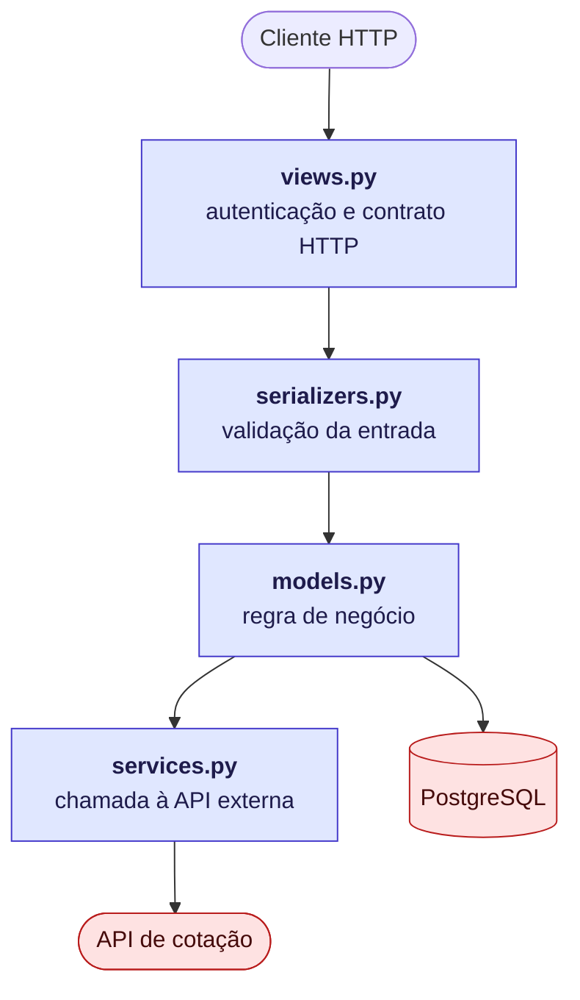
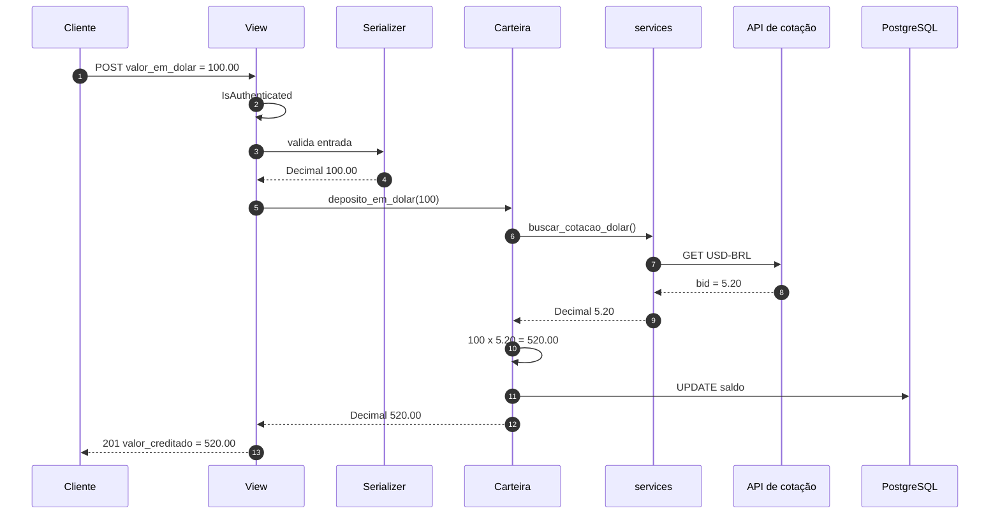
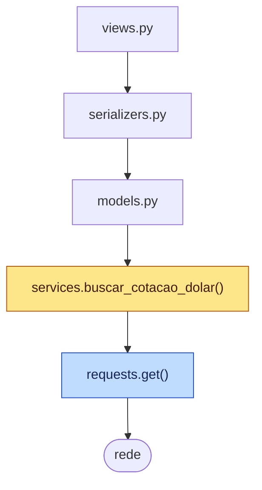
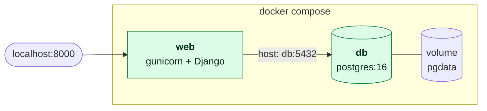

# Estrutura do projeto

API Django para uma carteira financeira, com depósito em dólar convertido pela
cotação atual. O projeto serve de exemplo de testes automatizados, mock,
cobertura e CI.

## Árvore

```
apollo/
├── apollo/                  configuração do projeto
│   ├── settings.py          apps, middleware, banco (via DATABASE_URL)
│   ├── urls.py              rotas raiz: /admin/ e /api/
│   ├── wsgi.py              ponto de entrada do gunicorn
│   └── asgi.py
│
├── financeiro/              app de domínio
│   ├── models.py            Carteira: deposito, saque, deposito_em_dolar
│   ├── services.py          integração com a API de cotação
│   ├── serializers.py       validação de entrada e formato de saída
│   ├── views.py             DepositarEmDolarView (APIView do DRF)
│   ├── exceptions.py        APIException de 503
│   ├── urls.py              rotas do app
│   ├── admin.py             registro da Carteira no admin
│   ├── migrations/
│   └── tests/
│       ├── test_services.py testes de função
│       ├── test_models.py   testes de model
│       ├── test_views.py    testes de view
│       └── test_e2e.py      teste de fluxo completo
│
├── .github/workflows/ci.yml pipeline de testes e cobertura
├── Dockerfile               imagem da aplicação
├── docker-compose.yml       web + postgres
├── entrypoint.sh            espera o banco, migra, collectstatic, sobe gunicorn
├── .coveragerc              configuração do coverage
├── requirements.txt         dependências de produção
└── requirements-dev.txt     produção + coverage e model-bakery
```

## Camadas



Cada camada só conhece a de baixo. A separação existe para que `services.py`
concentre tudo que fala com a rede — o que torna o mock trivial nos testes.

## Fluxo de um depósito



## Endpoint

```
POST /api/carteira/deposito-dolar/
```

Entrada:

```json
{ "valor_em_dolar": "100.00" }
```

Resposta (201):

```json
{ "valor_creditado": "520.00", "saldo_atual": "520.00" }
```

| Status | Quando |
|---|---|
| 201 | depósito realizado |
| 400 | valor ausente, não numérico ou menor que 0.01 |
| 403 | usuário não autenticado |
| 404 | usuário sem carteira |
| 503 | API de cotação indisponível |

## Testes

```bash
coverage run manage.py test financeiro
coverage report
```

Os quatro arquivos se distinguem pelo ponto onde cortam a cadeia com um mock:



O nó **amarelo** é onde `test_models.py` e `test_views.py` cortam: tudo abaixo
dele é substituído. O **azul** é onde `test_e2e.py` corta — só a chamada de
rede sai, e todas as camadas acima rodam de verdade.

| Arquivo | Alvo do mock | Roda de verdade |
|---|---|---|
| `test_services.py` | `requests.get` | services |
| `test_models.py` | `buscar_cotacao_dolar` | models |
| `test_views.py` | `buscar_cotacao_dolar` | views, serializers, models |
| `test_e2e.py` | `requests.get` | tudo |

## Infraestrutura



O `web` só inicia depois que o healthcheck do `db` passa. O host do banco é
`db`, não um IP — o Compose resolve pelo DNS interno.

## Execução

```bash
docker compose up --build
```

O `--build` é necessário quando muda `requirements.txt`, `Dockerfile` ou
`entrypoint.sh`. Para mudanças em código Python, `docker compose restart web`
basta — o código é montado por volume.
